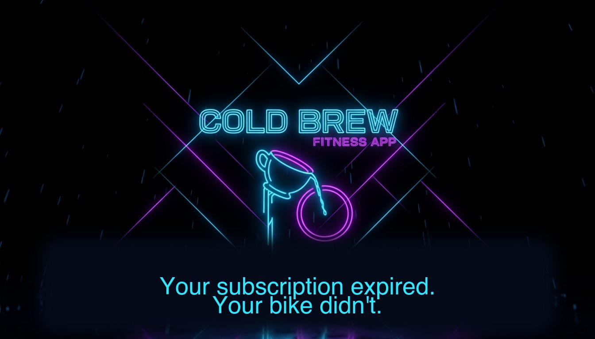

# Cold Brew - _Expresso unlocked_

**A toolkit to fully unlock Expresso HD recumbent bikes - all tracks, all games, no login nags.**

Expresso HD exercise bikes are awesome! They have immersive rides and games with steering, but the cloud service (eLive) is 
dead. Now the bikes show a locked menu, a handful of free routes, and refuse to unlock the rest.

**Cold Brew** makes a used Expresso HD into a fully-functional, fully-offline trainer —
all stock routes unlocked, no internet or login ever required. It is _yours forever_.

 

Notes:
- Tested on both 2013 and 2018 software versions.
- The bike runs Ubuntu and is easy and safe to hack on.
- **Do not be intimidated** - it is easy and safe.

> **Status:** research project. Runs on my hardware. If you try it on yours and
> it bricks, that sucks. Contribute back if you can.

---

## Quick start

**Not technical? Let an AI do it.** The easiest path by far: open this repo in
any AI coding assistant (Claude Code, Codex, Cursor, etc.) and ask it to help.
The assistant reads the built-in runbook and walks you through every step,
adapting to your exact bike and fixing mistakes as they come up.

Paste this to your AI assistant to start:

```
Help me unlock my Expresso bike. Read docs/agent-unlock-guide.md and walk me
through it, starting from getting the bike on WiFi. My bike model is: <what the
sticker or screen says>.
```

> **🤖 AI agents:** read [`docs/agent-unlock-guide.md`](docs/agent-unlock-guide.md)
> **now** before doing anything. It is the full runbook — including how to
> handle a bike model this repo hasn't documented yet (probe it, adapt the
> unlock, and send a report back so the next person has it easy).

Prefer to do it by hand? The three steps below are the whole job.

### Step 1: Get the bike online

The installer runs from your laptop and talks to the bike over the network, so
first the bike needs an IP address on the same network as your laptop.

**Easiest option — plug in an Ethernet cable.** If the bike has a wired network
port and you can run a cable to your router, do that. It gets an IP
automatically and you can skip the WiFi editing entirely. Jump to "Find the
bike's IP" below.

**WiFi option.** You'll need a **USB keyboard** plugged into the bike. You edit
one config file and run one script. It must be a **2.4 GHz** network — these
bikes do not do 5 GHz.

1. With the bike powered on, plug the USB keyboard into any USB port on it.
2. Press **Alt+F2**. A small "Run Application" box appears on the bike's screen.
   Type `xterm` and press **Enter**. A black terminal window opens.
3. In that terminal, open the config file in a text editor:

   ```bash
   gedit /usr/local/expresso/conf/ef_global.conf
   ```

   If `gedit` gives an error, try `nano` instead:
   `nano /usr/local/expresso/conf/ef_global.conf`

4. Find the two `Wireless…` lines (or add them at the bottom if missing). Set
   them to your network — plain text, **no quotes**:

   ```
   WirelessSSID = YourNetworkName
   WirelessPassword = YourNetworkPassword
   ```

   Capitalization matters for both the name and password. If a line starts with
   `#`, delete the `#`.

5. Save the file.
   - In **gedit**: **Ctrl+S** to save, then close the window.
   - In **nano**: **Ctrl+O** then **Enter** to save, then **Ctrl+X** to exit.

6. Back in the terminal, turn on WiFi with the bike's built-in script:

   ```bash
   ~/script/start-wireless-networking.sh
   ```

**Find the bike's IP.** Wait about 15 seconds, then run:

```bash
ip addr show wlan0     # WiFi
ip addr show eth0      # or this, if you used an Ethernet cable
```

Look for the line starting with `inet` — the number after it (e.g.
`192.168.1.100`) is the bike's IP address. Write it down; you'll use it in
Step 2. Everywhere a command below shows `192.168.1.100`, type your bike's IP
instead.

> **Keep the USB keyboard plugged in** until Step 2 confirms you can reach the
> bike from your laptop. If the network doesn't come up, the keyboard is your
> only way back in.
>
> **No IP after a minute?** Double-check the SSID/password spelling and that the
> network is 2.4 GHz, then re-run `~/script/start-wireless-networking.sh`. Your
> AI assistant can diagnose from here.

---

### Step 2: Install on a bike

```bash
# Dry-run first (the default)
./coldbrew-install.sh --target expresso@192.168.1.100

# When the dry-run output looks right:
./coldbrew-install.sh --target expresso@192.168.1.100 --live --with-branding
```

The installer:

1. rsyncs `payload/` to `/tmp/coldbrew_payload/` on the bike
2. invokes `payload/install-coldbrew.sh` under `sudo`
3. **backs up every file it touches** to `/home/expresso/coldbrew_backups/`
4. applies the unlock mechanisms for the detected build vintage (2013 or 2018)
5. optionally installs branding, watchdog, fake-server helpers

To uninstall, run the recovery script on the bike. It restores the newest backup by default:

```bash
BIKE_HOST=192.168.1.100 ./scripts/xbike --root \
  'bash /tmp/coldbrew_payload/recover-coldbrew.sh'
```

### Poke at a bike interactively

xbike is a wrapper around `ssh` that handles the old-sshd flag and handles
`BIKE_HOST` environment variable. It just makes repeat LLM calls more efficient.

```bash
./scripts/xbike                                    # interactive shell
./scripts/xbike 'ls /usr/local/expresso'           # one-shot
./scripts/xbike --root 'cat /etc/hosts'            # as root
./scripts/xbike --put local.sh /tmp/remote.sh      # scp
BIKE_HOST=192.168.1.101 ./scripts/xbike uptime     # target another bike
```

---

## Layout

```
.
├── coldbrew-install.sh     # main entry — push + install onto a bike
├── docker-run.sh           # build + run the mule container (optional)
├── Dockerfile
├── pyproject.toml          # Python project: mule/
│
├── docs/                   # project write-ups
│   ├── agent-unlock-guide.md  # step-by-step runbook for an AI assistant
│   ├── research.md         # RE dossier (what was found, how)
│   ├── coldbrew-installer.md
│   ├── deferred-ghosts.md
│   ├── models/             # per-model reports (sent back by users)
│   └── images/
│
├── scripts/                # helper shell scripts
│   ├── xbike               # ssh/scp wrapper with old-sshd flag handling
│   ├── bike-sync.sh        # repo ↔ bike file sync
│   ├── coldbrew-recon.sh   # on-bike system dump
│   ├── standalone-inca-test.sh  # test a staged build without flipping version
│   ├── use-build.sh        # flip CLUtil between installed build versions
│   └── ...
│
├── payload/                # everything rsync'd to the bike
│   ├── install-coldbrew.sh # the on-bike installer (runs as root)
│   ├── unlock.sh           # the core unlock sed/patch logic
│   ├── recover-coldbrew.sh # restore from backups/
│   ├── patches/            # Lua override blocks appended to stock files
│   ├── sql/                # inca_requests seed data
│   ├── coldbrew/           # splash images + taglines
│   ├── plymouth/           # early-boot plymouth splash
│   ├── conf/               # ef_global.conf.example (reference only)
│   └── etc/, usr/, home/   # on-bike config files, mirrored in-place
│
├── mule/                   # Python: serial probe + HID passthrough + AI-assist
└── compat/                 # per-build-vintage capability profiles
```

---

## How it works, in one paragraph

Inca (the game, a UE3 binary) reads Lua files at startup that define world
availability, login type, and account level. Cold Brew rewrites those Lua files
in place on the bike to report "signed in, account type 999, all content
unlocked" no matter what the server says. Since `services.expresso.net` is
dead, Dispenser (the cloud sync agent) falls through to cached responses in a
local MySQL `inca_requests` table — Coldbrew pre-seeds that table with a
valid-looking login response whose `account_type=3` and whose `route_groups`
list grants access to every world on disk. Everything else — `/etc/hosts`
blackhole, watchdog against Dispenser's CallHome thread, fake-server — exists
to keep those values from being rewritten at runtime.

---

## What it does

| Layer | What gets patched | Mechanism |
|---|---|---|
| Route lock | `LEVEL_AVAILABILITY_BRONZE` → `LEVEL_AVAILABILITY_ALL` | sed across world Lua files |
| Subscription check | `BikeSubscription = 1` in `ef_global.conf` | static edit + watchdog |
| Login / account | `GetLoginType`, `GetAccountType`, `IsUserIdEnabled` | Lua function overrides appended to `GlobalFunctions.lua` |
| Welcome / login screens | auto-skip to route list | append `SetGameState(GAME_STATE_SHELL)` in `shell_start.lua` + `shell_welcome.lua` |
| Server cache | inject a pre-built `login_user` response | `inca_requests` MySQL row |
| Network isolation | blackhole `services.expresso.net` + `updates.expresso.net` | `/etc/hosts` rewrite |
| Points / route-group gate (2018 only) | comment out `SetLevelGroupGUID` | sed |
| Branding | custom boot splash + rotating tagline art | `feh` fullscreen + hook in `gnome-startup-custom.sh` |

See [`docs/research.md`](docs/research.md) and [`CLAUDE.md`](CLAUDE.md) for the
full reverse-engineering write-up: how the binary protocol works, where the
DRM hooks are, what the serial protocol looks like over `ttyUSB1`.

---

## Non-goals

- **Not a distribution.** Coldbrew patches an Expresso installation in place.
  You still need a working Expresso HD system image — typically the one
  shipped on the bike. It does not ship any of Expresso Fitness's copyrighted
  binaries, Lua, or art assets.
- **Not a Zwift bridge (yet).** Phase 2 plans an ANT+ FE-C / BLE FTMS bridge
  so the bike's 0–1888 resistance protocol can be driven by Zwift or
  TrainerRoad. That work lives in `mule/` but isn't production-ready.
- **Not an anti-DRM tool.** These bikes were sold as a perpetual appliance
  and the manufacturer's cloud was shut down in 2025. Coldbrew restores
  functionality that the owner already paid for.
- **Not a route pack.** Custom track generation is possible (UE3 Lua + spline
  text files) but no tracks are bundled in this repo. Bring your own.

---

## Credits

- Reverse-engineering, unlock mechanism discovery, and installer:
  [@carlkibler](https://github.com/carlkibler)
- All work done on hardware purchased used, after the manufacturer's cloud
  service had already been shut down.

## License

TBD — see [`LICENSE`](LICENSE) when it lands. Until then, ask first.
